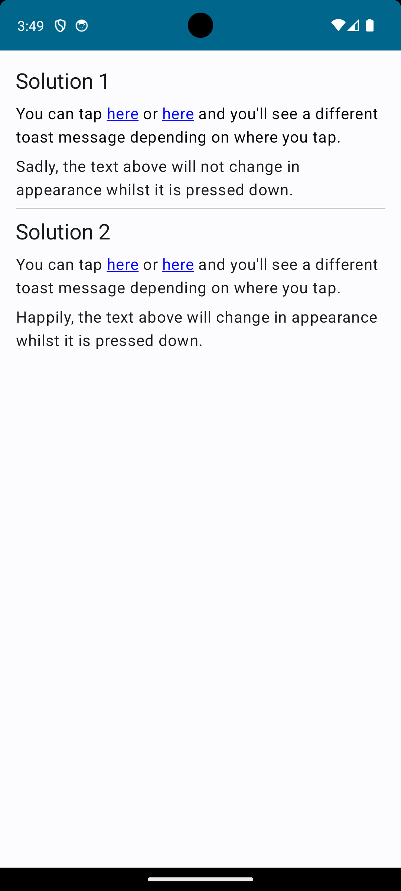

# Tappable text demonstration

This Jetpack Compose Android application demonstrates how to wire up a text element to perform different actions
depending on which part of its text is tapped.

You'll find two different solutions in this app, as follows:

* [ClickableText1][1] – This solution uses [ClickableText][3]. It is the simpler of the two solutions but it has a shortcoming: It has no callback to tell you when the element is pressed down.
* [ClickableText2][2] – This solution uses [Text][4]. Though it is the more complicated of the two solutions, it has an advantage: It has a callback to tell you when the element is pressed down.

When you run the app, you will see a user interface as follows:

[1]: src/main/java/com/tazkiyatech/compose/experiments/app1/ClickableText1.kt
[2]: src/main/java/com/tazkiyatech/compose/experiments/app1/ClickableText2.kt
[3]: https://developer.android.com/reference/kotlin/androidx/compose/foundation/text/package-summary#ClickableText(androidx.compose.ui.text.AnnotatedString,kotlin.Function1,androidx.compose.ui.Modifier,androidx.compose.ui.text.TextStyle,kotlin.Boolean,androidx.compose.ui.text.style.TextOverflow,kotlin.Int,kotlin.Function1,kotlin.Function1)
[4]: https://developer.android.com/reference/kotlin/androidx/compose/material/package-summary#Text(kotlin.String,androidx.compose.ui.Modifier,androidx.compose.ui.graphics.Color,androidx.compose.ui.unit.TextUnit,androidx.compose.ui.text.font.FontStyle,androidx.compose.ui.text.font.FontWeight,androidx.compose.ui.text.font.FontFamily,androidx.compose.ui.unit.TextUnit,androidx.compose.ui.text.style.TextDecoration,androidx.compose.ui.text.style.TextAlign,androidx.compose.ui.unit.TextUnit,androidx.compose.ui.text.style.TextOverflow,kotlin.Boolean,kotlin.Int,kotlin.Int,kotlin.Function1,androidx.compose.ui.text.TextStyle)
