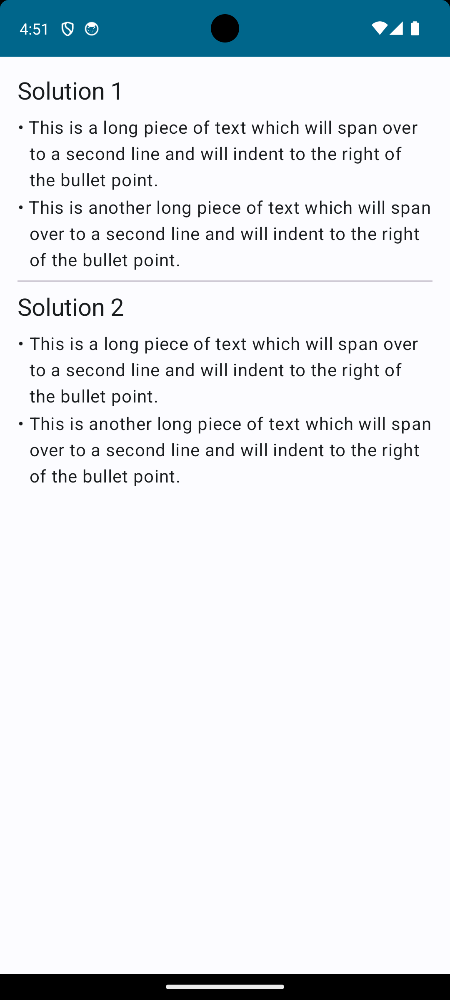

# Demo: Two different ways of creating a bulleted list

This Android application demonstrates how to create a bulleted list with [Jetpack Compose][7].

You'll find two different solutions in this app, as follows:

* [BulletedList1][1] – This solution uses a single [Text][3] together with a [ParagraphStyle][5] to represent each list item.
* [BulletedList2][2] – This solution uses a [Row][6] containing two [Text][4] views to represent each list item.

When you run the app, you will see a user interface as follows:

[1]: src/main/java/com/tazkiyatech/compose/experiments/app2/BulletedList1.kt
[2]: src/main/java/com/tazkiyatech/compose/experiments/app2/BulletedList2.kt
[3]: https://developer.android.com/reference/kotlin/androidx/compose/material/package-summary#Text(androidx.compose.ui.text.AnnotatedString,androidx.compose.ui.Modifier,androidx.compose.ui.graphics.Color,androidx.compose.ui.unit.TextUnit,androidx.compose.ui.text.font.FontStyle,androidx.compose.ui.text.font.FontWeight,androidx.compose.ui.text.font.FontFamily,androidx.compose.ui.unit.TextUnit,androidx.compose.ui.text.style.TextDecoration,androidx.compose.ui.text.style.TextAlign,androidx.compose.ui.unit.TextUnit,androidx.compose.ui.text.style.TextOverflow,kotlin.Boolean,kotlin.Int,kotlin.Int,kotlin.collections.Map,kotlin.Function1,androidx.compose.ui.text.TextStyle)
[4]: https://developer.android.com/reference/kotlin/androidx/compose/material/package-summary#Text(kotlin.String,androidx.compose.ui.Modifier,androidx.compose.ui.graphics.Color,androidx.compose.ui.unit.TextUnit,androidx.compose.ui.text.font.FontStyle,androidx.compose.ui.text.font.FontWeight,androidx.compose.ui.text.font.FontFamily,androidx.compose.ui.unit.TextUnit,androidx.compose.ui.text.style.TextDecoration,androidx.compose.ui.text.style.TextAlign,androidx.compose.ui.unit.TextUnit,androidx.compose.ui.text.style.TextOverflow,kotlin.Boolean,kotlin.Int,kotlin.Int,kotlin.Function1,androidx.compose.ui.text.TextStyle)
[5]: https://developer.android.com/reference/kotlin/androidx/compose/ui/text/ParagraphStyle
[6]: https://developer.android.com/reference/kotlin/androidx/compose/foundation/layout/package-summary#Row(androidx.compose.ui.Modifier,androidx.compose.foundation.layout.Arrangement.Horizontal,androidx.compose.ui.Alignment.Vertical,kotlin.Function1)
[7]: https://developer.android.com/jetpack/compose
