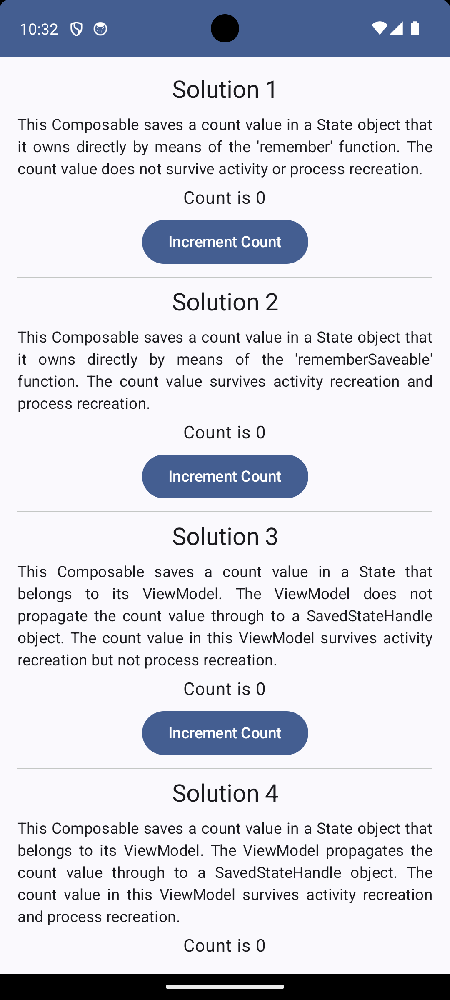

# State demonstration

This Android application demonstrates different ways of remembering state in [Jetpack Compose][7] views.

You'll find six different [Composable][8] functions in this app, as follows:

* [Solution1View][1] – This [Composable][8] defines a [State][9] object within itself by means of the [remember][10] function.
* [Solution2View][2] – This [Composable][8] defines a [State][9] object within itself by means of the [rememberSaveable][11] function.
* [Solution3View][3] – This solution ???
* [Solution4View][4] – This solution ???
* [Solution5View][5] – This solution ???
* [Solution6View][6] – This solution ???

When you run the app, you will see a user interface as follows:

[1]: src/main/java/com/tazkiyatech/compose/experiments/app3/Solution1View.kt
[2]: src/main/java/com/tazkiyatech/compose/experiments/app3/Solution2View.kt
[3]: src/main/java/com/tazkiyatech/compose/experiments/app3/Solution3View.kt
[4]: src/main/java/com/tazkiyatech/compose/experiments/app3/Solution4View.kt
[5]: src/main/java/com/tazkiyatech/compose/experiments/app3/Solution5View.kt
[6]: src/main/java/com/tazkiyatech/compose/experiments/app3/Solution6View.kt
[7]: https://developer.android.com/jetpack/compose
[8]: https://developer.android.com/reference/kotlin/androidx/compose/runtime/Composable
[9]: https://developer.android.com/reference/kotlin/androidx/compose/runtime/State
[10]: https://developer.android.com/reference/kotlin/androidx/compose/runtime/package-summary#remember(kotlin.Function0)
[11]: https://developer.android.com/reference/kotlin/androidx/compose/runtime/saveable/package-summary#rememberSaveable(kotlin.Array,androidx.compose.runtime.saveable.Saver,kotlin.String,kotlin.Function0)
