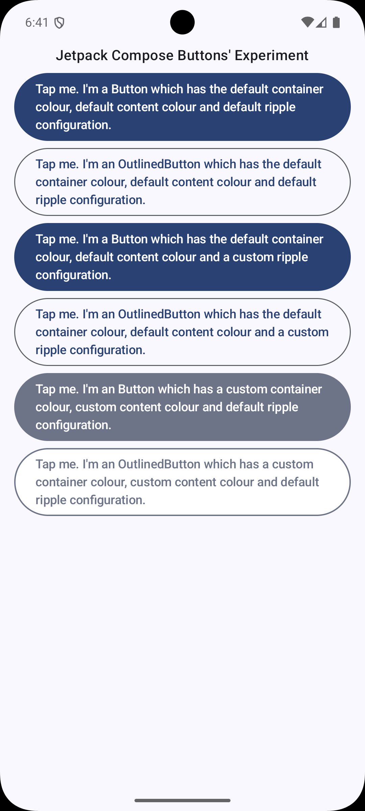

# Buttons' demonstration

This Jetpack Compose Android application demonstrates different ways of changing
the container colour, content colour and ripple effect of buttons.

When you run the app, you will see a user interface as follows:

