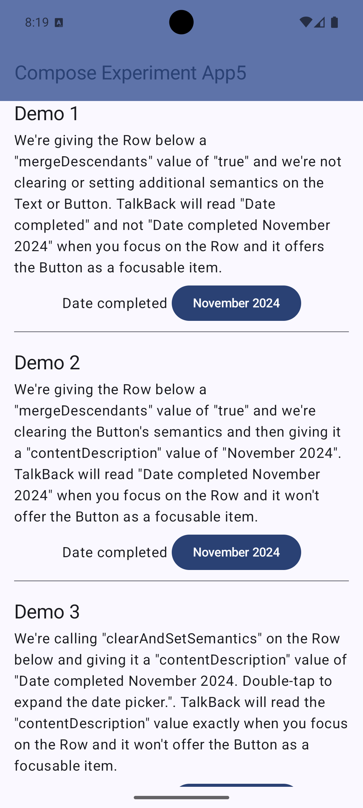

# Accessibility demonstration

This Jetpack Compose Android application demonstrates that specifying `mergeDescendants = true` on a [Row][1]
does not in fact merge the contents of a [Row][1] which contains a [Text][2] item and a [Button][3] item.

When you run the app, you will see a user interface as follows:

[1]: https://developer.android.com/reference/kotlin/androidx/compose/foundation/layout/package-summary#Row(androidx.compose.ui.Modifier,androidx.compose.foundation.layout.Arrangement.Horizontal,androidx.compose.ui.Alignment.Vertical,kotlin.Function1)
[2]: https://developer.android.com/reference/kotlin/androidx/compose/material3/package-summary#Text(kotlin.String,androidx.compose.ui.Modifier,androidx.compose.ui.graphics.Color,androidx.compose.ui.unit.TextUnit,androidx.compose.ui.text.font.FontStyle,androidx.compose.ui.text.font.FontWeight,androidx.compose.ui.text.font.FontFamily,androidx.compose.ui.unit.TextUnit,androidx.compose.ui.text.style.TextDecoration,androidx.compose.ui.text.style.TextAlign,androidx.compose.ui.unit.TextUnit,androidx.compose.ui.text.style.TextOverflow,kotlin.Boolean,kotlin.Int,kotlin.Int,kotlin.Function1,androidx.compose.ui.text.TextStyle)
[3]: https://developer.android.com/reference/kotlin/androidx/compose/material3/package-summary#Button(kotlin.Function0,androidx.compose.ui.Modifier,kotlin.Boolean,androidx.compose.ui.graphics.Shape,androidx.compose.material3.ButtonColors,androidx.compose.material3.ButtonElevation,androidx.compose.foundation.BorderStroke,androidx.compose.foundation.layout.PaddingValues,androidx.compose.foundation.interaction.MutableInteractionSource,kotlin.Function1)
