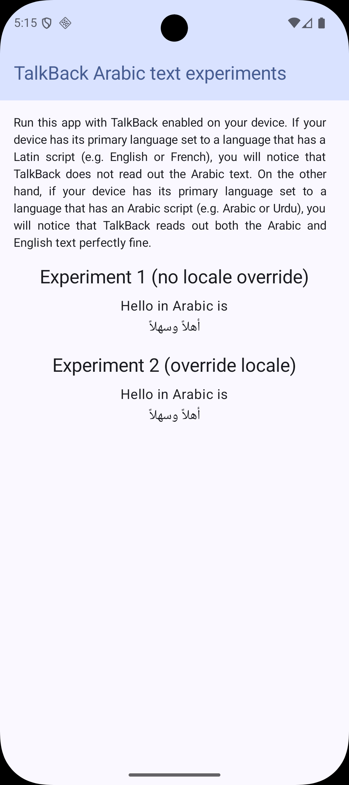

# Demo: TalkBack does not read out Arabic text when the device's language is set to English

This Android application demonstrates that TalkBack does not read the contents of a [Text][text-composable] item
that contains Arabic text when the device's language is set to English.

I consider this behaviour a bug because TalkBack reads the contents of a [Text][text-composable] item
that contains English text perfectly fine when the device's language is set to Arabic.

When you run the app, you will see a user interface as follows:

## Links

1. [Stack Overflow > Can I get TalkBack to read Arabic text in my mostly English app when the device language is set to English?][stackoverflow-question]
2. [Google IssueTracker > TalkBack does not read the contents of a Text item which contains Arabic text when the device's language is set to English][issuetracker-issue]

[issuetracker-issue]: https://issuetracker.google.com/issues/431173128
[stackoverflow-question]: https://stackoverflow.com/questions/79698480
[text-composable]: https://developer.android.com/reference/kotlin/androidx/compose/material/package-summary#Text(kotlin.String,androidx.compose.ui.Modifier,androidx.compose.ui.graphics.Color,androidx.compose.ui.unit.TextUnit,androidx.compose.ui.text.font.FontStyle,androidx.compose.ui.text.font.FontWeight,androidx.compose.ui.text.font.FontFamily,androidx.compose.ui.unit.TextUnit,androidx.compose.ui.text.style.TextDecoration,androidx.compose.ui.text.style.TextAlign,androidx.compose.ui.unit.TextUnit,androidx.compose.ui.text.style.TextOverflow,kotlin.Boolean,kotlin.Int,kotlin.Int,kotlin.Function1,androidx.compose.ui.text.TextStyle)
